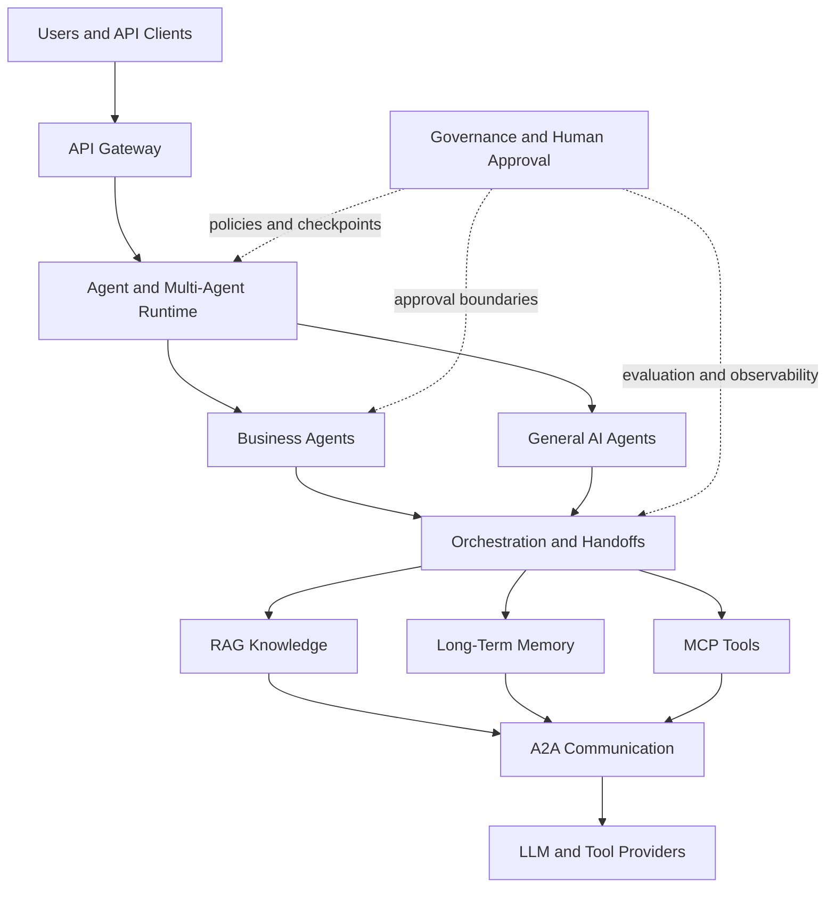

# AgentForge AI

**Enterprise Multi-Agent AI Operations Platform**

> Coordinate specialized AI agents, enterprise knowledge, tools, memory, and human approvals through one extensible platform.

[English](./README.md) | [Retained Chinese documentation](./docs/upstream/README.zh-CN.md)

## Overview

AgentForge AI is an enterprise-oriented foundation for multi-agent applications. It combines agent execution, retrieval-augmented generation (RAG), long-term memory, Model Context Protocol (MCP) tools, agent-to-agent (A2A) communication, and governance services behind a shared API gateway and operator interface.

This repository is a customized and extended derivative of [`atliliw/agent-platform`](https://github.com/atliliw/agent-platform). The upstream service architecture and implementation remain attributable to `atliliw` and contributors. AgentForge branding, the Business Agent Pack, catalog validation, integration code, tests, and supporting documentation are AgentForge-specific additions; no upstream endorsement is implied.

AgentForge AI is a software foundation, not a claim of production certification, regulatory compliance, customer adoption, or benchmark performance. Deployers remain responsible for security hardening, identity and access controls, tenant isolation, provider review, evaluation, observability, and approval policy.

## Key Capabilities

### Core Platform Capabilities

- Multi-agent execution with streaming, tool calls, handoffs, checkpoints, interventions, and resumable sessions.
- RAG knowledge services with document ingestion, chunking, BM25 and vector retrieval, and Qdrant-backed indexing.
- Episodic, semantic, and working-memory services with recall and consolidation controls.
- Built-in and remote MCP tool discovery and execution.
- A2A agent discovery and task dispatch over gRPC and HTTP endpoints.
- Reusable agent skills with progressive loading.
- Harness services for guardrails, approvals, evaluations, prompts, workflows, SLOs, traces, session replay, and cost analytics.
- A tenant-aware Gin gateway, Go microservices, React operator interface, Docker Compose topologies, and OpenTelemetry collection.

### AgentForge Extensions

- A five-role Business Agent Pack for governed operations, revenue, customer, risk, and executive-analysis workflows.
- Catalog validation and an adapter that integrates the business-agent definitions with the existing agent service.
- Evidence, uncertainty, and human-approval boundaries embedded in business-agent instructions.
- English architecture, configuration, deployment, API, development, and business-agent documentation.
- Lightweight pull-request CI for Go formatting, build, vet, tests, and frontend compilation.

## Architecture



The gateway is the external HTTP boundary. Backend services use gRPC and retain separate responsibilities for chat, agents, knowledge, memory, A2A communication, tools, and governance. See [Architecture](./docs/en/architecture.md) for service topology, trust boundaries, failure modes, and approval flows.

## Business Agent Pack

Fresh installations add five AgentForge definitions alongside the existing upstream default agents:

| Agent | Purpose | Human boundary |
| --- | --- | --- |
| Business Operations Director | Coordinate cross-functional analysis and handoffs | High-impact plans remain recommendations |
| Revenue Intelligence Agent | Analyze revenue operations and scenarios | No pricing, forecast, CRM, financial, or outbound execution |
| Customer Operations Agent | Synthesize cases and draft resolutions | No account changes, refunds, cancellations, or message sending |
| Risk and Compliance Review Agent | Review evidence against policy and risk criteria | No legal conclusion, filing, certification, or regulatory action |
| Executive Briefing Agent | Produce decision-ready, evidence-aware briefs | Briefs do not approve or execute decisions |

The pack uses verified built-in tools and explicit handoff contracts. Existing installations are not silently reseeded when their agent store is already populated. For the complete catalog contract, flows, tool policy, and extension guide, see [Business Agents](./docs/en/business-agents.md).

## Enterprise Use Cases

- Cross-functional operating reviews with specialist handoffs and explicit decision owners.
- Internal knowledge assistants using hybrid retrieval, contextual memory, and governed tools.
- Revenue and pipeline analysis based on traceable inputs and stated assumptions.
- Customer-operations case synthesis and draft resolution communications.
- Risk and compliance review that reserves legal, regulatory, privacy, and financial decisions for qualified humans.
- Executive briefings that preserve evidence, uncertainty, dissent, and approval requirements.
- Multi-agent workflows with checkpoints, evaluation, trace collection, and cost visibility.

## Tech Stack

| Layer | Technology |
| --- | --- |
| Backend | Go 1.22, Gin, gRPC, Protocol Buffers |
| Persistence and retrieval | MongoDB, SQLite, Qdrant, Redis |
| Agent integration | MCP tools, A2A services, OpenAI-compatible LLM endpoint support |
| Frontend | React 19, TypeScript, Ant Design 6, TanStack Query, Zustand, React Flow, Monaco, ECharts, Tailwind CSS 4, Vite |
| Observability | OpenTelemetry Collector |
| Deployment | Docker and Docker Compose |

The default example configuration targets DashScope/Qwen through an OpenAI-compatible endpoint. The Go module remains `agent-platform` for compatibility with the upstream codebase.

## Quick Start

Prerequisites: Docker with Compose and a supported LLM API key.

```bash
# Generate the gitignored service configuration files.
bash scripts/init-config.sh sk-your-dashscope-key

# Windows PowerShell alternative:
pwsh scripts/init-config.ps1 sk-your-dashscope-key

# Build and start the full topology.
docker compose -f docker/docker-compose.yaml up -d --build

# Verify the gateway.
curl http://localhost:9000/health
```

Open the frontend at `http://localhost:8888` or call the gateway at `http://localhost:9000`. For a reduced local topology without the full browser, desktop, and observability sidecars, use:

```bash
docker compose -f docker/docker-compose.simple.yaml up -d --build
```

Real service configuration and credentials are gitignored. Review [Configuration](./docs/en/configuration.md) and [Deployment](./docs/en/deployment.md) before exposing any service.

## Project Structure

```text
.
├── .github/workflows/   # Pull-request and branch CI
├── configs/             # Shared configuration examples
├── docker/              # Full and reduced Compose topologies
├── docs/                # English and retained Chinese documentation
├── frontend/            # React operator interface
├── pkg/                 # Shared Go packages, generated APIs, and business agents
├── proto/               # Protocol Buffer contracts
├── scripts/             # Configuration and development helpers
└── services/            # Gateway, agents, chat, knowledge, memory, A2A, MCP, and harness services
```

## Documentation

| Topic | Reference |
| --- | --- |
| Documentation index | [docs/README.md](./docs/README.md) |
| Architecture and trust boundaries | [docs/en/architecture.md](./docs/en/architecture.md) |
| Business Agent Pack | [docs/en/business-agents.md](./docs/en/business-agents.md) |
| Configuration | [docs/en/configuration.md](./docs/en/configuration.md) |
| Deployment | [docs/en/deployment.md](./docs/en/deployment.md) |
| API reference | [docs/en/api-reference.md](./docs/en/api-reference.md) |
| Development | [docs/en/development.md](./docs/en/development.md) |
| Upstream and fork attribution | [NOTICE.md](./NOTICE.md) |

## Upstream & Attribution

AgentForge AI preserves its upstream derivation, Git history, authorship, service identifiers, Go module path, and MIT license declaration. Upstream code is not presented as original AgentForge work. AgentForge-specific modifications are identified separately and do not imply sponsorship, partnership, certification, or endorsement by the upstream project.

See the [Attribution Notice](./NOTICE.md) for the complete statement.

## License

Licensed under the [MIT License](./LICENSE). The upstream copyright and permission notice remain intact. AgentForge-specific modifications are distributed under the same license; redistribution should preserve the license, attribution notice, and applicable authorship history.
