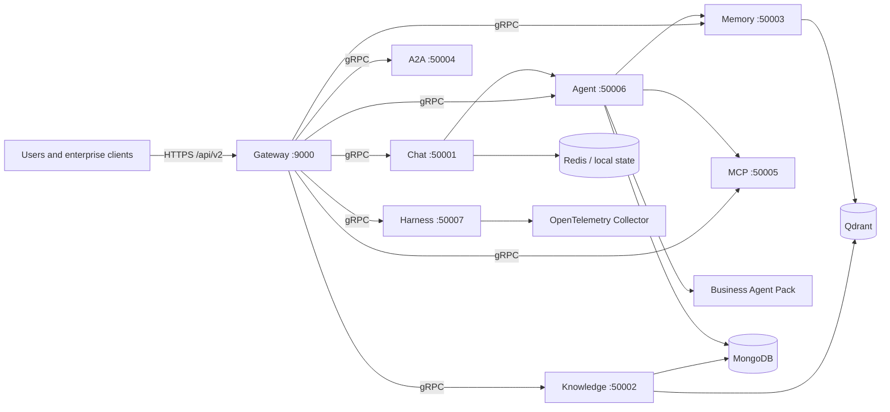

# AgentForge AI — Enterprise Multi-Agent AI Operations Platform

> Coordinate specialized AI agents, enterprise knowledge, tools, memory, and human approvals through one extensible operations platform.

[English](./README.md) | [简体中文](./README.zh-CN.md)

AgentForge AI is an independent fork of [`atliliw/agent-platform`](https://github.com/atliliw/agent-platform). It retains the upstream Git history, authorship, module path, service identifiers, and MIT licensing. The AgentForge branding, Business Agent Pack, and related documentation are additions to this fork; no upstream endorsement is implied.

## Product Positioning

AgentForge AI is an enterprise-oriented foundation for teams that need multiple AI agents to research, reason, use governed tools, retrieve internal knowledge, maintain contextual memory, and hand work to one another. The platform separates conversational execution from knowledge, memory, tools, orchestration, and governance so operators can deploy or replace each concern independently.

The repository is a software foundation, not a claim of a certified or production-proven managed service. Teams remain responsible for deployment hardening, model and data-provider review, tenant isolation, identity controls, observability, evaluation, and approval policy before production use.

## Enterprise Use Cases

- Cross-functional operating reviews with specialist handoffs and explicit decision owners.
- Revenue and pipeline analysis based on traceable inputs and scenario assumptions.
- Customer-operations case synthesis and draft resolution communications.
- Risk and compliance review that routes final legal, regulatory, privacy, or financial decisions to qualified humans.
- Executive briefings that preserve evidence, uncertainty, dissent, and approval requirements.
- Internal knowledge assistants using hybrid retrieval, long-term memory, and governed MCP tools.
- Multi-agent workflows with checkpoints, approvals, session replay, evaluation, and cost monitoring.

## Platform Capabilities

- **Multi-agent orchestration** — ReAct-style execution, streaming, tool calls, agent handoffs, checkpoints, interventions, and resumable session state.
- **Business Agent Pack** — five original, compileable business-agent definitions integrated into fresh-installation default seeding.
- **RAG knowledge services** — document ingestion, chunking, BM25 and vector retrieval, with Qdrant-backed indexing.
- **Layered memory** — episodic, semantic, and working-memory services with recall, consolidation, and forgetting controls.
- **MCP tools** — built-in and remotely connected Model Context Protocol tools, including knowledge, web, browser, and desktop primitives.
- **Skills** — reusable skill definitions mounted by agent ID with progressive disclosure.
- **Harness governance** — guardrails, approvals, evaluations, prompt management, workflows, SLOs, traces, session replay, and cost analytics.
- **Tenant-aware gateway** — a Gin HTTP gateway for `/api/v2` routes with tenant context passed to backend services.
- **Deployable stack** — Go microservices, a React frontend, Docker Compose topologies, and OpenTelemetry collection.

## Technology Stack

| Layer | Technology |
| --- | --- |
| Backend | Go 1.22 |
| Service communication | gRPC + Protocol Buffers |
| HTTP gateway | Gin |
| Agent persistence | MongoDB |
| Metadata | SQLite where configured by individual services |
| Vector retrieval | Qdrant |
| Cache and ephemeral state | Redis |
| Observability | OpenTelemetry Collector |
| Frontend | React 19, Ant Design 6, TanStack Query, Zustand, React Flow, Monaco, ECharts, Tailwind 4, Vite |
| Default LLM integration | DashScope/Qwen through an OpenAI-compatible API |
| Deployment | Docker and Docker Compose |

The Go module remains `agent-platform` for compatibility with the upstream codebase.

## High-Level Architecture



The gateway is the external HTTP boundary. Backend services communicate over gRPC and retain separate responsibilities and stores. See [Architecture](./docs/en/architecture.md) for trust boundaries, failure modes, approvals, and deployment topology.

## Services and Responsibilities

| Service | Port | Responsibility |
| --- | ---: | --- |
| Gateway | 9000 | HTTP routing, tenant middleware, request translation, health endpoints |
| Chat Service | 50001 | Conversations, streaming responses, and agent execution entry points |
| Knowledge Service | 50002 | Document ingestion, chunking, BM25/vector retrieval |
| Memory Service | 50003 | Layered long-term memory and recall |
| A2A Service | 50004 | Agent discovery and cross-service task dispatch |
| MCP Service | 50005 | Built-in and remote MCP tool discovery and execution |
| Agent Service | 50006 | Agent registry, execution, handoffs, skills, checkpoints, interventions, approvals |
| Harness Service | 50007 | Guardrails, evaluations, prompts, workflows, SLOs, cost and trace governance |
| MCP Demo Server | 50009 | MCP protocol test server |
| Frontend | 8888 | Browser-based operator interface in the production Compose topology |

## Business Agent Pack

Fresh installations seed the existing upstream default agents plus these AgentForge definitions:

| Agent | Domain | Risk tier | Approval boundary |
| --- | --- | --- | --- |
| Business Operations Director | Cross-functional operations | High | Operating plans and high-impact actions remain recommendations pending authorized human approval |
| Revenue Intelligence Agent | Revenue operations | High | Pricing, forecasts, CRM/financial changes, commitments, and outbound messages are never executed |
| Customer Operations Agent | Customer service operations | High | Account changes, refunds, credits, cancellations, and customer messages remain drafts |
| Risk and Compliance Review Agent | Policy and compliance review | High | No legal conclusion, approval, filing, certification, or regulatory action is executed |
| Executive Briefing Agent | Executive decision support | Moderate | Briefs support decisions but do not imply approval or execute decisions |

The catalog uses only verified built-in tool names (`knowledge_search`, `web_search`, and `calculator`), validates IDs and handoffs, and converts definitions through a small adapter in `pkg/agent`. Existing installations are not silently reseeded because `InitializeDefaultAgents` exits when the agent store is non-empty. See [Business Agents](./docs/en/business-agents.md).

## Quick Start

### Docker Compose

Prerequisites: Docker with Compose and a supported LLM API key.

```bash
# 1. Generate each service's gitignored config.yaml.
bash scripts/init-config.sh sk-your-dashscope-key

# Windows PowerShell alternative:
pwsh scripts/init-config.ps1 sk-your-dashscope-key

# 2. Build and start the full stack from repository sources.
docker compose -f docker/docker-compose.yaml up -d --build

# 3. Verify the gateway.
curl http://localhost:9000/health
```

Open the frontend at `http://localhost:8888` or call the gateway at `http://localhost:9000`.

For a smaller topology without the full observability/browser sidecars, use:

```bash
docker compose -f docker/docker-compose.simple.yaml up -d --build
```

### Local Development

Generated protobuf sources are committed, so ordinary Go changes do not require `protoc`.

```bash
go test ./pkg/businessagents ./pkg/agent
go test ./...

make test        # go test -v -race ./...
make lint        # golangci-lint run ./..., when installed
make fmt         # go fmt ./...
```

`make build` invokes protobuf generation before compiling all services. Install `protoc` and the Go protobuf plugins before using that target. See [Development](./docs/en/development.md) for the repository's exact prerequisites and known command notes.

## Configuration and Deployment

- Each service reads a `config.yaml`; real configuration files and secrets are gitignored.
- `config.example.yaml` files are committed templates. Generate local configs with `scripts/init-config.sh` or `scripts/init-config.ps1`.
- Do not commit LLM, search, weather, database, or remote MCP credentials.
- The full Compose file includes gateway, application services, MongoDB, Qdrant, Redis, browser/desktop sidecars, frontend, and the OpenTelemetry Collector.
- The simple Compose file is appropriate for a reduced local evaluation topology.
- Review network exposure, TLS termination, authentication, authorization, backup, secret management, retention, and tenant isolation before production deployment.

See [Configuration](./docs/en/configuration.md) and [Deployment](./docs/en/deployment.md).

## Security, Governance, and Human Approval

Agent outputs are untrusted recommendations until evaluated against application policy and authoritative data. Operators should enforce least-privilege tool access, tenant-scoped data retrieval, input/output guardrails, audit logging, model-provider controls, and explicit approval workflows.

The Business Agent Pack is intentionally analysis-oriented. It has no account-write, payment, CRM-write, filing, or messaging tools. Its system instructions require evidence and uncertainty disclosure, prohibit execution claims, and reserve legal, financial, compliance, customer-account, and external-communication actions for authorized humans. The Harness approval and policy components provide integration points, but deployments must configure and test those controls for their own risk model.

## Documentation

| Topic | Reference |
| --- | --- |
| Documentation index | [docs/README.md](./docs/README.md) |
| Architecture and trust boundaries | [docs/en/architecture.md](./docs/en/architecture.md) |
| Business Agent Pack | [docs/en/business-agents.md](./docs/en/business-agents.md) |
| Configuration | [docs/en/configuration.md](./docs/en/configuration.md) |
| Deployment | [docs/en/deployment.md](./docs/en/deployment.md) |
| API reference | [docs/en/api-reference.md](./docs/en/api-reference.md) |
| Development | [docs/en/development.md](./docs/en/development.md) |

## Project Status

AgentForge AI is under active development. The repository contains working service, agent, retrieval, memory, MCP, governance, frontend, and deployment code, but no claim is made here about production certification, scale, availability, customer adoption, regulatory compliance, or benchmark performance. Validate the code and controls in an environment representative of your intended deployment.

## Upstream Attribution

This repository is an independent fork of [`atliliw/agent-platform`](https://github.com/atliliw/agent-platform). Upstream code, history, and authorship remain attributable to `atliliw` and contributors. AgentForge-specific branding, documentation, and business-agent modules are modifications to the fork and do not imply endorsement by the upstream project. See [NOTICE.md](./NOTICE.md).

## License

Licensed under the MIT License. The upstream code remains under its MIT licensing declaration, and AgentForge-specific modifications are distributed under the same license. See [LICENSE](./LICENSE) and [NOTICE.md](./NOTICE.md).
