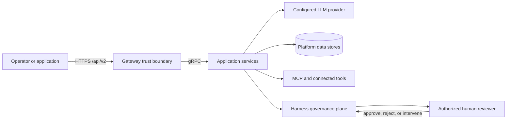
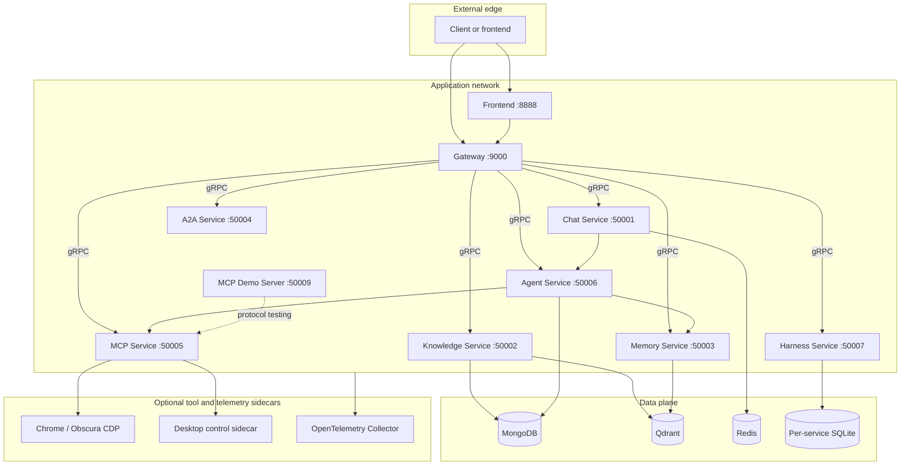
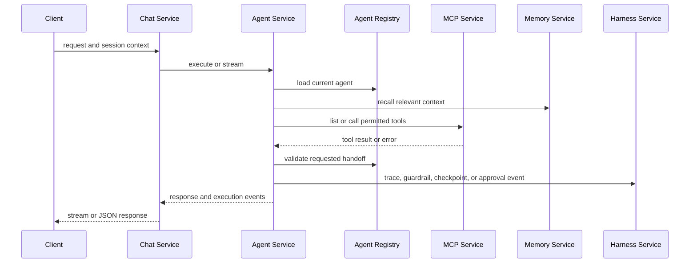
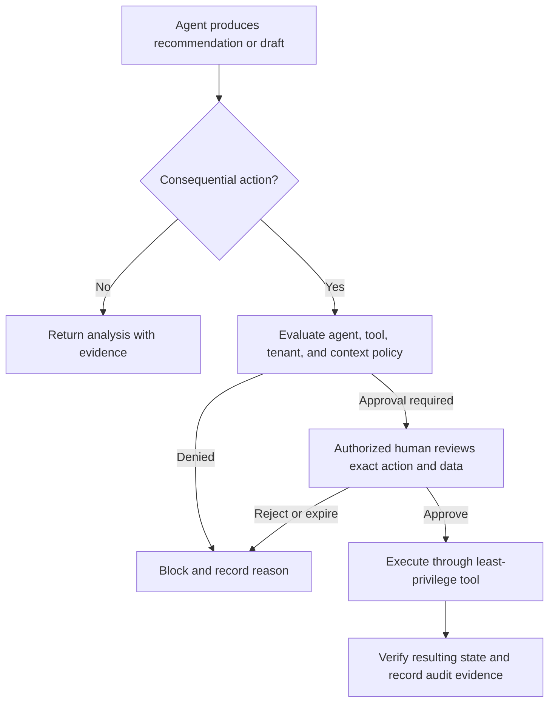
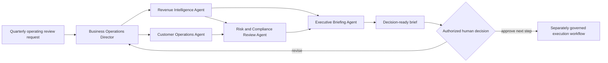

# AgentForge AI Architecture

> System, service, trust, and governance architecture for AgentForge AI, a customized derivative of [`atliliw/agent-platform`](https://github.com/atliliw/agent-platform).

## Architectural Goals

AgentForge AI separates external API access, conversations, agent execution, knowledge retrieval, memory, tools, and governance into independently deployable services. The design supports multi-agent handoffs and tool-assisted reasoning while keeping high-impact business actions behind application-defined policy and human approval.

This document describes the code and supplied deployment topology. It does not assert that a deployment is secure, compliant, highly available, or production-ready without environment-specific controls and validation.

## System Context

The gateway is the intended external API boundary. LLM providers, remote MCP servers, retrieved documents, websites, and model output are separate trust domains and should be treated as untrusted inputs. Human reviewers are authorization principals, not merely another agent.

## Deployment Topology and Service Boundaries

| Boundary | Responsibility | Not responsible for |
| --- | --- | --- |
| Gateway | HTTP routing, tenant middleware, request/response translation, health endpoints | Agent reasoning, document retrieval, long-term storage |
| Chat Service | Conversation and streaming orchestration | Tool implementation or governance policy ownership |
| Knowledge Service | Ingestion, chunking, BM25/vector retrieval | Deciding whether retrieved content is authoritative |
| Memory Service | Episodic, semantic, and working-memory operations | Authorization of recalled data for a different tenant or purpose |
| A2A Service | Agent discovery and task dispatch | Human authorization or tool safety |
| MCP Service | Tool discovery, built-in execution, and remote MCP connections | Trusting remote tool output or granting unrestricted tool access |
| Agent Service | Registry, execution loop, handoffs, skills, checkpoints, interventions, approvals integration | Final business authorization |
| Harness Service | Guardrails, evaluations, prompts, workflows, SLOs, cost, traces, approvals, replay | Replacing environment-specific IAM, legal review, or security operations |

## Gateway and gRPC Communication

External clients call REST endpoints under `/api/v2` through the Gin gateway on port 9000. Gateway handlers create backend gRPC requests through clients in `pkg/client`. The gateway's tenant middleware attaches tenant context, but deployments must verify that tenant identity is authenticated, propagated, enforced in every downstream query, and included in audit records.

Backend-to-backend gRPC is an application-network interface, not an automatic trust guarantee. Production deployments should add authenticated service identity, transport encryption, network policy, timeouts, retry budgets, message-size limits, and per-method authorization.

## Multi-Agent Orchestration

The multi-agent engine in `pkg/agent` supports an agent registry, ReAct-style execution, tool calls, streaming events, handoff tools, checkpoints, intervention, context handling, skills, and persistence. An agent can hand off only to an ID listed in its `Handoffs`; the registry verifies that the target exists.

Handoffs transfer reasoning responsibility; they do not transfer human authority, widen tenant access, or bypass tool policy.

## Business Agent Pack

`pkg/businessagents` is a runtime-neutral catalog. Each definition contains a stable ID, domain, responsibility, original instructions, verified tool names, handoffs, risk tier, human-approval flag, output contract, evidence requirements, and safe fallback. `pkg/agent/business_agents.go` converts those definitions into the existing `Agent` type with fresh slices and scalar metadata.

`DefaultAgents()` appends the five business agents to the existing upstream defaults. `InitializeDefaultAgents()` writes defaults only when the agent store is empty. Therefore:

- A fresh agent store receives both the upstream defaults and the Business Agent Pack.
- An existing non-empty store is not modified or silently reseeded.
- Operators upgrading an existing deployment must import or create the new agents through a reviewed migration if they want them.

The pack uses `knowledge_search`, `web_search`, and `calculator`, all registered by the MCP service. It intentionally does not include account-write, payment, CRM-write, filing, browser-write, or messaging tools.

See [Business Agents](./business-agents.md) for individual contracts and extension guidance.

## MCP Tools and External Integrations

The MCP service exposes built-in tool definitions and can connect to remote MCP servers. The code includes knowledge search, web search, calculator, weather, browser automation, fine-grained browser primitives, computer-use, and domain-specific tools. Agent definitions receive tools by name; the engine resolves names against the tool list returned by the MCP service.

Remote MCP servers and websites are external trust domains. Deployments should allowlist servers and tool names, validate schemas, constrain credentials, redact sensitive arguments and outputs, set timeouts and call limits, and require human approval for consequential tools. Tool success means an invocation returned; it does not prove that a business outcome was completed correctly.

## RAG and Memory

Knowledge ingestion stores documents and indexes chunks for BM25 and vector retrieval. Qdrant provides vector search, while MongoDB stores document and agent persistence where configured. Retrieval results must preserve source identity, timestamp, tenant, and authorization context so an agent can distinguish evidence from model inference.

Memory is divided into episodic, semantic, and working layers. Recall, consolidation, graph/timeline views, and forgetting mechanisms support longer-lived context. Memory is not an authorization system: a recalled item must still be permitted for the current tenant, user, purpose, and retention policy.

## Harness Governance Plane

The Harness service contains guardrails, rule checks, evaluation suites, A/B tests, SLOs, LLM metrics, cost and budget analytics, prompt versioning, workflow execution, session replay, checkpoints, approvals, interventions, feature flags, model routing, and related operator controls.

These components provide enforcement and evidence hooks. A deployment must configure which checks are blocking, who may approve, how approvals expire, which agent/tool combinations are permitted, how audit records are protected, and what happens when the Harness service is unavailable.

## Tenant and Trust Boundaries

| Asset or actor | Trust concern | Required deployment control |
| --- | --- | --- |
| Client identity | Spoofing or privilege confusion | Authenticated identity, session protection, role and tenant authorization |
| Tenant context | Cross-tenant access | End-to-end propagation and enforcement in services, stores, retrieval, memory, traces, and tools |
| LLM provider | Data disclosure and untrusted output | Provider review, minimization, retention controls, output validation |
| Retrieved content | Stale, poisoned, or unauthorized evidence | Provenance, freshness, access checks, citation, conflict handling |
| MCP tool or remote server | Over-broad side effects or credential use | Allowlist, least privilege, schema validation, approval and audit |
| Browser/desktop sidecar | Authenticated session or host control | Isolation, dedicated credentials, network boundaries, recorded approvals |
| Human reviewer | Incorrect or stale authorization | Strong identity, scoped roles, explicit decision context, expiry and audit |
| Telemetry | Sensitive prompts, arguments, or customer data | Redaction, access control, retention, encryption, tenant scoping |

## Approval Checkpoints

Approval should be evaluated before a consequential tool call or external effect, not after an agent reports success.

The Business Agent Pack stops at recommendations or drafts. If operators extend it with effectful tools, they must add an approval rule and post-action verification appropriate to that tool.

## Observability

The full Compose topology includes an OpenTelemetry Collector on ports 4317 and 4318. Services can emit traces and metrics to the collector; Harness endpoints expose trace, metric, and statistical views. Useful correlation fields include tenant ID, user ID, session ID, agent ID, handoff source/target, tool name, approval ID, model/provider, latency, token usage, error category, and checkpoint ID.

Telemetry must not become an uncontrolled copy of prompts, secrets, customer records, tool arguments, or model outputs. Apply structured redaction and retention before exporting data.

## Failure Handling and Graceful Degradation

| Failure | Expected safe behavior |
| --- | --- |
| LLM provider unavailable | Return a bounded error; do not fabricate a completion or repeat without a retry budget |
| MCP tool unavailable | Report the missing capability and continue with analysis only when safe |
| Remote tool result ambiguous | Treat the action as unverified; do not claim completion |
| Knowledge retrieval empty or conflicting | Mark evidence insufficient or conflicting and request the minimum missing input |
| Memory service unavailable | Continue only when the task does not require prior context; disclose the limitation |
| Handoff target absent | Reject the handoff and keep control with the current agent |
| Harness/approval service unavailable | Fail closed for approval-required actions; analysis-only responses may continue if policy allows |
| Store unavailable | Avoid partial writes, surface the error, and rely on idempotency/checkpoints for reviewed retry |
| Client disconnect during streaming | Cancel or checkpoint work according to session policy; do not assume the client received the result |

Retries should be bounded, idempotent where possible, and visible in traces. Partial execution must be distinguished from a verified business outcome.

## Representative Business Workflow

The workflow retrieves source material, separates facts from assumptions, records handoffs, preserves risk findings, and creates a brief. Approval does not occur inside the specialist agents, and downstream execution must use a separately governed tool or business process.

## Further Reading

- [Business Agents](./business-agents.md)
- [Configuration](./configuration.md)
- [Deployment](./deployment.md)
- [API Reference](./api-reference.md)
- [Development](./development.md)
- [Attribution Notice](../../NOTICE.md)
