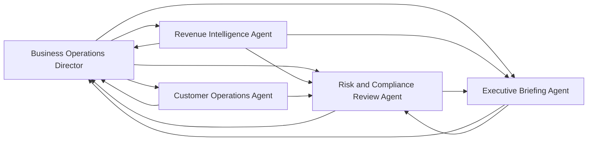

# Business Agent Pack

The AgentForge AI Business Agent Pack adds five original, compileable business-agent definitions to the existing multi-agent engine. The catalog is implemented in `pkg/businessagents`, adapted in `pkg/agent/business_agents.go`, and included by `pkg/agent.DefaultAgents()`.

The agents are decision-support components. They do not have account-write, payment, CRM-write, filing, browser-write, or messaging tools. Legal, financial, compliance, customer-account, and external-communication actions remain recommendations or drafts pending authorized human approval.

## Catalog Contract

Every definition includes:

- Stable ID and human-readable name.
- Business domain and responsibility.
- Original system instructions.
- Existing MCP tool names only.
- Valid handoff targets.
- Risk tier and human-approval flag.
- Ordered output sections.
- Evidence and uncertainty requirements.
- Safe fallback behavior.

`ValidateCatalog` rejects empty required fields, duplicate IDs, unsupported risk tiers, unsupported or duplicate tools, missing or duplicate handoff targets, self-handoffs, and empty output contracts. `Catalog()` and the adapter copy slices so callers cannot mutate later catalog results.

## Handoff Flow

Handoff is bounded by each definition's allowlist. A handoff changes the active specialist; it does not approve an action, expand tool permissions, or relax tenant/data policy.

## Agent Reference

### Business Operations Director

- **ID:** `business-operations-director`
- **Domain:** Cross-functional business operations.
- **Responsibility:** Triage requests, coordinate specialist analysis, surface dependencies, and prepare operating plans.
- **Tools:** `knowledge_search`, `web_search`, `calculator`.
- **Handoffs:** All four specialist business agents.
- **Risk tier:** High.
- **Approval boundary:** High-impact operating actions remain recommendations until an authorized human approves them.
- **Output contract:** Objective and Scope; Evidence Reviewed; Operating Assessment; Recommended Plan; Decisions and Approvals Required; Risks and Dependencies; Open Questions.
- **Evidence rule:** Cite material sources, identify assumptions and owners, and never convert missing data into zero.
- **Fallback:** Produce a provisional brief and request the minimum missing evidence or decision.

### Revenue Intelligence Agent

- **ID:** `revenue-intelligence-agent`
- **Domain:** Revenue operations and commercial analysis.
- **Responsibility:** Analyze pipeline evidence, commercial signals, and forecast scenarios.
- **Tools:** `knowledge_search`, `web_search`, `calculator`.
- **Handoffs:** Business Operations Director, Risk and Compliance Review Agent, Executive Briefing Agent.
- **Risk tier:** High.
- **Approval boundary:** It cannot change prices, CRM/financial records, commitments, or external communications.
- **Output contract:** Question; Evidence and Data Quality; Findings; Scenario Analysis; Recommended Actions; Approval Required; Uncertainty and Missing Data.
- **Evidence rule:** Identify source, period, currency/unit, and assumptions; separate actuals, estimates, and scenarios.
- **Fallback:** Return a data-gap assessment and reproducible method instead of invented values.

### Customer Operations Agent

- **ID:** `customer-operations-agent`
- **Domain:** Customer support and service operations.
- **Responsibility:** Synthesize customer context, classify service issues, and prepare resolution plans and draft communications.
- **Tools:** `knowledge_search`, `web_search`.
- **Handoffs:** Business Operations Director, Risk and Compliance Review Agent.
- **Risk tier:** High.
- **Approval boundary:** Account changes, refunds, credits, cancellations, and outbound messages are drafts pending authorization.
- **Output contract:** Customer Objective; Verified Context; Issue Assessment; Proposed Resolution; Draft Communication; Approval and Ownership; Unknowns and Follow-up.
- **Evidence rule:** Use the supplied/retrieved customer record, preserve provenance and timestamps, and do not infer identity, entitlement, or account state.
- **Fallback:** Produce a privacy-minimized case summary and route to a human owner without changing the account.

### Risk and Compliance Review Agent

- **ID:** `risk-compliance-review-agent`
- **Domain:** Risk, policy, and compliance review.
- **Responsibility:** Compare proposals with available policies, controls, and jurisdictional evidence.
- **Tools:** `knowledge_search`, `web_search`.
- **Handoffs:** Business Operations Director, Executive Briefing Agent.
- **Risk tier:** High.
- **Approval boundary:** It is not legal counsel and cannot approve, file, certify, sign, or execute legal, financial, regulatory, privacy, or compliance actions.
- **Output contract:** Review Scope; Evidence and Applicable Requirements; Findings; Risk Rating and Rationale; Required Controls; Human Decision Required; Residual Uncertainty.
- **Evidence rule:** Cite policy/control, jurisdiction, and effective date; distinguish requirements, internal policy, guidance, and unresolved applicability.
- **Fallback:** Limit the review and escalate to the appropriate qualified owner.

### Executive Briefing Agent

- **ID:** `executive-briefing-agent`
- **Domain:** Executive decision support.
- **Responsibility:** Compress verified analyses into decision-ready briefs without hiding uncertainty or dissent.
- **Tools:** `knowledge_search`, `calculator`.
- **Handoffs:** Business Operations Director, Risk and Compliance Review Agent.
- **Risk tier:** Moderate.
- **Approval boundary:** Briefs inform but do not approve or execute decisions.
- **Output contract:** Executive Summary; Decision Required; Verified Signals; Options and Trade-offs; Risks and Controls; Recommended Next Step; Owners, Approvals, and Open Questions.
- **Evidence rule:** Trace material statements to inputs; preserve dates, confidence, disagreement, and missing data.
- **Fallback:** Return a conflict-and-gap brief instead of selecting an unsupported narrative.

## Tools and Safety

The catalog uses only these names verified in `services/mcp-service/internal/service/mcp_service.go`:

| Tool | Use | Side-effect posture |
| --- | --- | --- |
| `knowledge_search` | Retrieve internal knowledge through the gateway | Read-oriented; retrieved content remains untrusted evidence |
| `web_search` | Retrieve current public information when configured | Read-oriented; sources must be cited and evaluated |
| `calculator` | Reproduce arithmetic used in scenarios | Local calculation; assumptions and units must be shown |

The agent engine resolves a tool name only when it appears in the MCP service's current tool definitions. Remote environment configuration can still make a named tool unavailable; agents must use their safe fallback rather than claim success.

## Fresh Versus Existing Installations

`InitializeDefaultAgents` checks the persistent agent store count before saving defaults.

| Installation state | Behavior |
| --- | --- |
| Empty/fresh agent store | Existing upstream default agents and all five business agents are saved |
| Non-empty/existing agent store | Initialization returns without inserting or updating any agent |

This protects customized deployments from silent mutations. To add the pack to an existing installation, operators should use a reviewed migration or existing agent API, compare IDs first, preserve local customizations, and verify the stored definitions after import.

## Extending the Pack

1. Add a definition function in `pkg/businessagents` with a stable, namespaced ID.
2. Include it in `Catalog()`.
3. Use only tool names registered by the MCP service in the target deployment.
4. Add every target agent to the definition's `Handoffs` and ensure the target is in the catalog.
5. Define a risk tier, approval boundary, output contract, evidence requirements, and safe fallback.
6. Add or update catalog and `pkg/agent` integration tests.
7. Run `gofmt` and the relevant Go tests, then `go test ./...`.
8. If adding an effectful tool, configure least-privilege access, a blocking approval checkpoint, expiry, audit evidence, and post-action verification before enabling it.

Do not change the upstream Go module path or service identifiers merely to brand a new agent.

## Related Documentation

- [Architecture](./architecture.md)
- [API Reference](./api-reference.md)
- [Configuration](./configuration.md)
- [Development](./development.md)
- [Attribution Notice](../../NOTICE.md)
